# c++视频学习笔记（cherno）

学习资料：

* B站`https://www.bilibili.com/video/BV1Xf4y1v7he`

## 1. 欢迎来到 c++

略

## 2. windows 上安装 c++

略

## 3. Mac 上安装 c++

略

## 4. Linux上安装 c++

略


## 13. Visual Studio的最佳设置

创建一个空的项目，NewProject

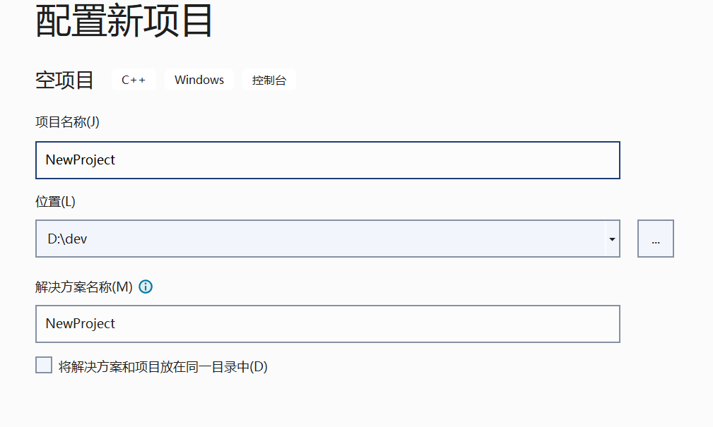

添加Main.cpp


上图中的类似目录的东西，只是一个过滤器，并非真实的目录，只是用来更好的组织文件。

点击下图红色按钮，可以看到真实的目录结构

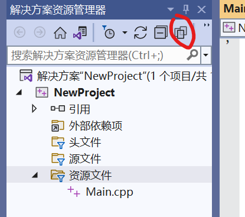

添加一个src目录，把Main.cpp挪进去

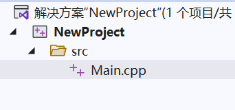

设置编译后文件的输出目录

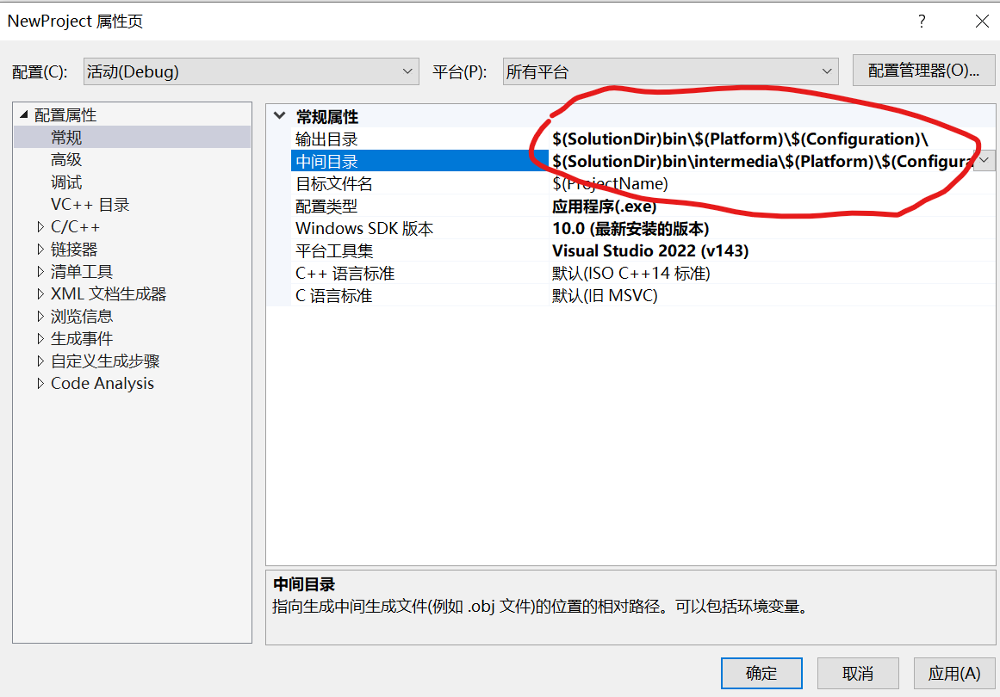

```txt
输出目录： $(SolutionDir)bin\$(Platform)\$(Configuration)\
中间目录： $(SolutionDir)bin\intermedia\$(Platform)\$(Configuration)\
```

## 16. c++ 指针

**指针是一种数字，一种存储内存地址的数字**

* 指针的类型不重要，它只是用来只是编译器所指向数据的类型，以便让它知道要数据占多大的内存
* 指针的值也是存在一个内从块中
* 二级指针就是一个存储另一个指针地址的指针

## 85. c++的左值与右值

```c++
int main()
{
	int i = 10;
}
```

左值绝大多数时候在等号左边，右值在右边，但这并不总是对的，但在上面的例子中是对的：

* 变量`i`是个左值，它是在内存中有位置的实际变量
* 数字字面量`10`是一个右值，没有存储空间，没有位置

不能给一个右值赋值，比如不能给`10`赋值等于`i`，因为`10`没有位置，不能在`10`中存储数据：

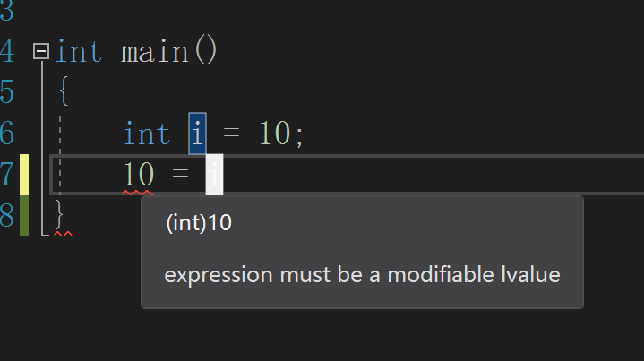

但是可以把`i`赋值给`a`，也就是说“等号右边就是右值”的说法是不对的

```c++
int main()
{
	int i = 10;
	int a = i;
}
```

右值不只是像`10`这样的字面量，它也可以是函数的结果：

```c++
int GetValue()
{
	return 10;
}

int main()
{
	int i = GetValue();
}
```

`GetValue()`返回一个右值。它返回的是一个临时值，即使它返回一个int，它也没有位置，没有存储空间，它只返回值10。

因为它是一个右值，所以不能给它赋值：

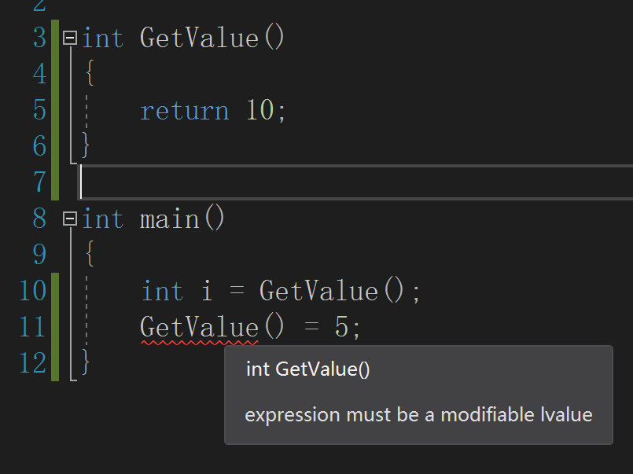

> 提示“表达式必须是可修改的左值”，这意味着 它必须是非const的左值

下面是一样的效果：

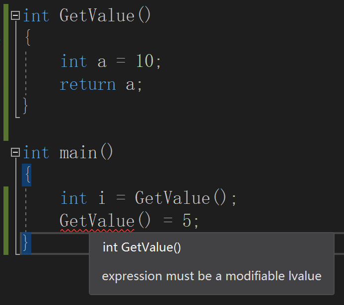

如果函数返回的是一个左值引用，就可以给它赋值：

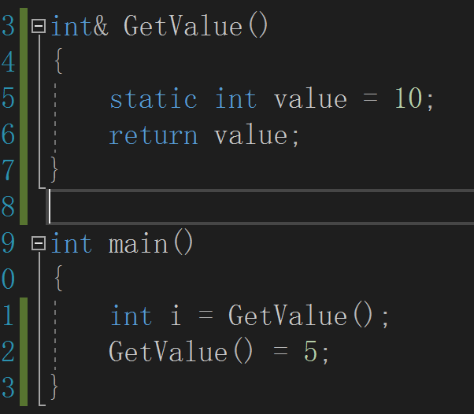

另一个规则是：不能将右值赋值给左值引用：

* 下面的代码正确：

  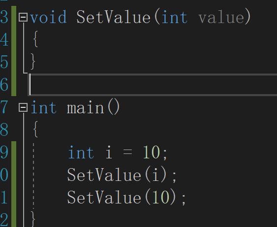

* 下面的代码不行：

  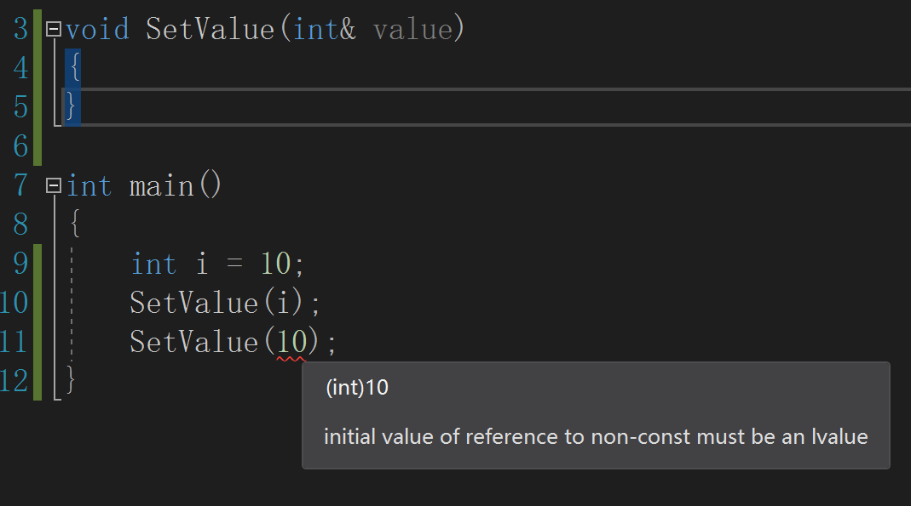

这里有个特殊的规则：虽然不能用左值来引用右值，但是如果假设const就可行。

> 这是一种变通方法，实际情况是，编译器可能会用你的存储创建一个临时变量，然后把它赋值给那个引用。
>
> 如下面的语句：
>
> const int & a = 10;
>
> 可能等价于：
>
> int temp=10; const int & a = temp;

回到上面的例子，加一个const就可以同时支持左值、右值来调用：

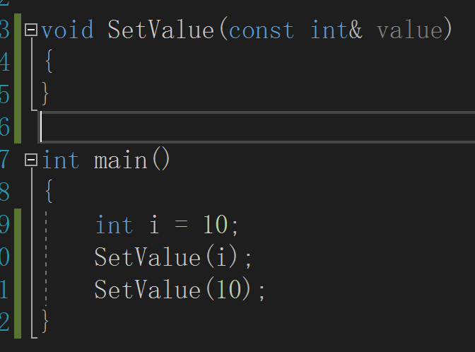

另一个例子：

```c++
int main()
{
	std::string firstName = "Yan";
	std::string lastName = "Chernikov";

	std::string fullName = firstName + lastName;
}
```

* 表达式左边的都是左值，右边都是右值
* `firstName + lastName`两个组成一个临时字符串，产生一个新的字符串字面量，是一个右值

如果把右值传给字符串的引用是行不通的

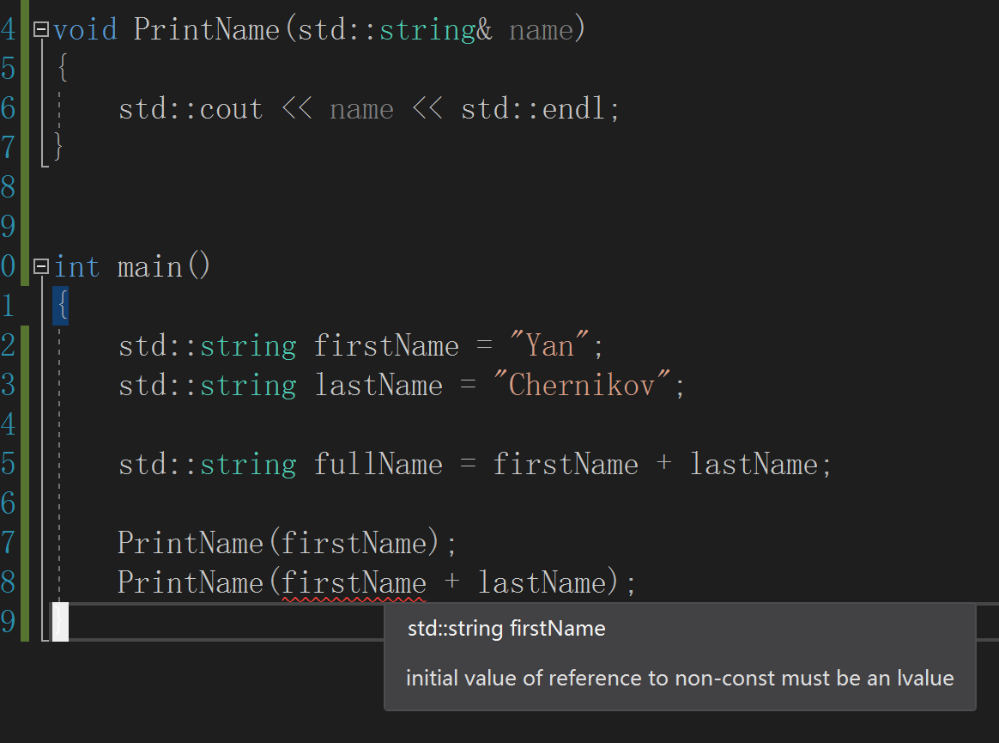

如果加上一个const就可以兼容临时的右值和实际存在的左值变量

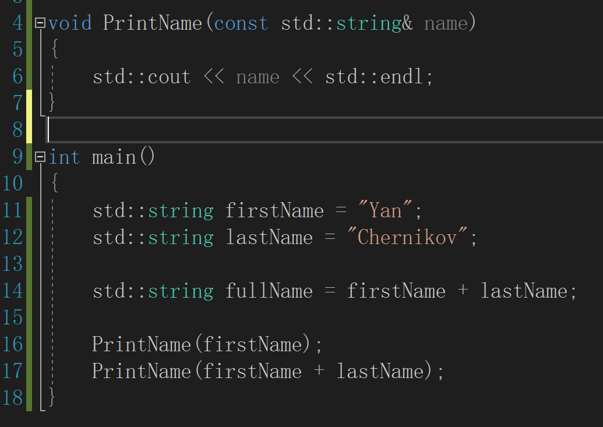

**右值引用：**只能传递右值，不能传递左值给它

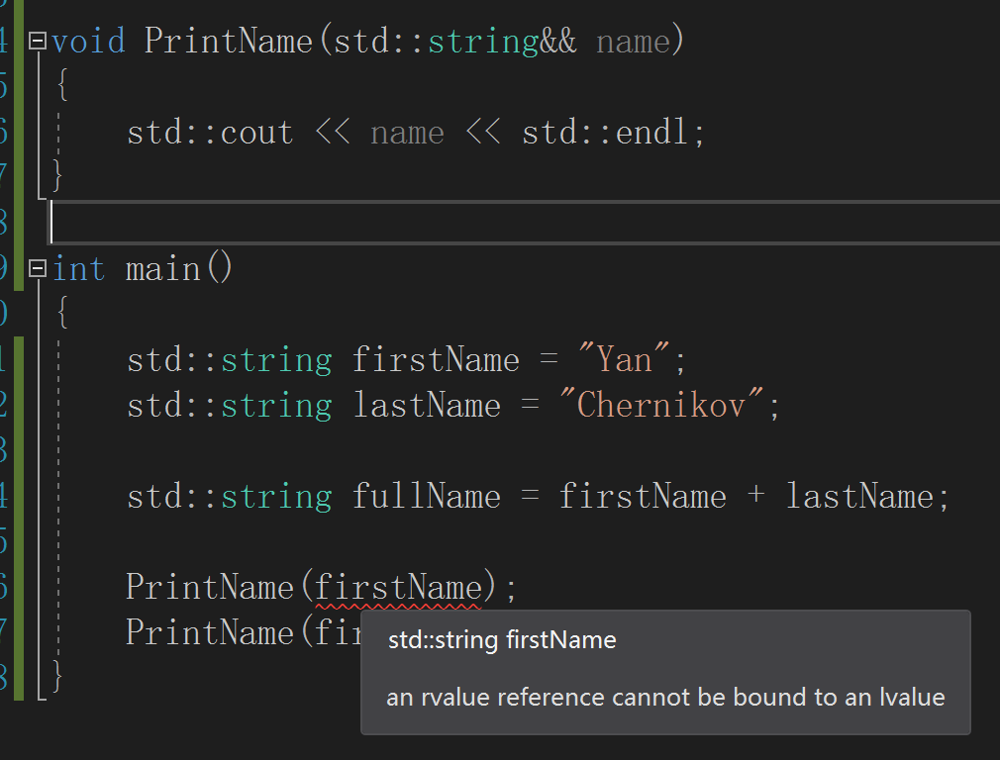

可以写两个重载的函数来检测是左值还是右值：

```c++
void PrintName(const std::string& name)
{
	std::cout << "[lvalue] " << name << std::endl;
}

void PrintName(std::string&& name)
{
	std::cout << "[rvalue] " << name << std::endl;
}

int main()
{
	std::string firstName = "Yan";
	std::string lastName = "Chernikov";

	std::string fullName = firstName + lastName;

	PrintName(firstName);
	PrintName(firstName + lastName);

	std::cin.get();
}
```

输出：

```bash
[lvalue] Yan
[rvalue] YanChernikov
```

