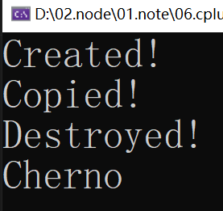
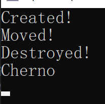
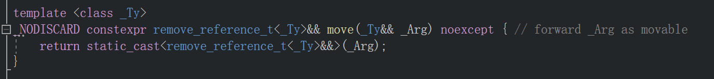
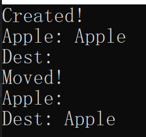

# c++视频学习笔记（cherno）

学习资料：

* B站`https://www.bilibili.com/video/BV1Xf4y1v7he`
* 参考学习笔记：`https://github.com/Nagi-ovo/Cherno-CPP-Notes`

## 1. 欢迎来到 c++

略

## 2. windows 上安装 c++

略

## 3. Mac 上安装 c++

略

## 4. Linux上安装 c++

略


## 13. Visual Studio的最佳设置

创建一个空的项目，NewProject


添加Main.cpp


上图中的类似目录的东西，只是一个过滤器，并非真实的目录，只是用来更好的组织文件。

点击下图红色按钮，可以看到真实的目录结构


添加一个src目录，把Main.cpp挪进去


设置编译后文件的输出目录


```txt
输出目录： $(SolutionDir)bin\$(Platform)\$(Configuration)\
中间目录： $(SolutionDir)bin\intermedia\$(Platform)\$(Configuration)\
```

## 16. c++ 指针

**指针是一种数字，一种存储内存地址的数字**

* 指针的类型不重要，它只是用来只是编译器所指向数据的类型，以便让它知道要数据占多大的内存
* 指针的值也是存在一个内从块中
* 二级指针就是一个存储另一个指针地址的指针

## 85. c++的左值与右值

```c++
int main()
{
	int i = 10;
}
```

左值绝大多数时候在等号左边，右值在右边，但这并不总是对的，但在上面的例子中是对的：

* 变量`i`是个左值，它是在内存中有位置的实际变量
* 数字字面量`10`是一个右值，没有存储空间，没有位置

不能给一个右值赋值，比如不能给`10`赋值等于`i`，因为`10`没有位置，不能在`10`中存储数据：


但是可以把`i`赋值给`a`，也就是说“等号右边就是右值”的说法是不对的

```c++
int main()
{
	int i = 10;
	int a = i;
}
```

右值不只是像`10`这样的字面量，它也可以是函数的结果：

```c++
int GetValue()
{
	return 10;
}

int main()
{
	int i = GetValue();
}
```

`GetValue()`返回一个右值。它返回的是一个临时值，即使它返回一个int，它也没有位置，没有存储空间，它只返回值10。

因为它是一个右值，所以不能给它赋值：


> 提示“表达式必须是可修改的左值”，这意味着 它必须是非const的左值

下面是一样的效果：


如果函数返回的是一个左值引用，就可以给它赋值：


另一个规则是：不能将右值赋值给左值引用：

* 下面的代码正确：

  

* 下面的代码不行：

  

这里有个特殊的规则：虽然不能用左值来引用右值，但是如果假设const就可行。

> 这是一种变通方法，实际情况是，编译器可能会用你的存储创建一个临时变量，然后把它赋值给那个引用。
>
> 如下面的语句：
>
> const int & a = 10;
>
> 可能等价于：
>
> int temp=10; const int & a = temp;

回到上面的例子，加一个const就可以同时支持左值、右值来调用：


另一个例子：

```c++
int main()
{
	std::string firstName = "Yan";
	std::string lastName = "Chernikov";

	std::string fullName = firstName + lastName;
}
```

* 表达式左边的都是左值，右边都是右值
* `firstName + lastName`两个组成一个临时字符串，产生一个新的字符串字面量，是一个右值

如果把右值传给字符串的引用是行不通的


如果加上一个const就可以兼容临时的右值和实际存在的左值变量


**右值引用：**只能传递右值，不能传递左值给它


可以写两个重载的函数来检测是左值还是右值：

```c++
void PrintName(const std::string& name)
{
	std::cout << "[lvalue] " << name << std::endl;
}

void PrintName(std::string&& name)
{
	std::cout << "[rvalue] " << name << std::endl;
}

int main()
{
	std::string firstName = "Yan";
	std::string lastName = "Chernikov";

	std::string fullName = firstName + lastName;

	PrintName(firstName);
	PrintName(firstName + lastName);

	std::cin.get();
}
```

输出：

```bash
[lvalue] Yan
[rvalue] YanChernikov
```

## 89. 移动语义

移动语义允许我们移动对象。c++11引入了右值引用，这是移动语义所必须的。

在很多情况下，我们不需要或者不想把一个对象从一个地方复制到另一个地方，但又不得不复制，因为这是唯一可以复制的地方。

例如，如果我把一个对象传递给一个函数，那么它要获得那个对象的所有权，别无选择，只能拷贝；当我想从函数返回一个对象时也是一样的，仍然需要在函数中创建那个对象，然后返回它。

> 返回值可以有其他优化方式（`返回值优化`），不一定要用移动语义

### 示例：

```c++
#include <iostream>

class String 
{
public:
	String() = default;
	String(const char* string) 
	{
		printf("Created!\n");
		m_Size = strlen(string);
		m_Data = new char[m_Size];
		memcpy(m_Data, string, m_Size);
	}

	String(const String& other) 
	{
		printf("Copied!\n");
		m_Size = other.m_Size;
		m_Data = new char[m_Size];
		memcpy(m_Data, other.m_Data, m_Size);
	}

	~String()
	{
		printf("Destroyed!\n");
		delete m_Data;
	}

	void Print()
	{
		for (uint32_t i = 0; i < m_Size; i++) {
			printf("%c", m_Data[i]);
		}
		printf("\n");
	}

public:
	char* m_Data;
	uint32_t m_Size;
};

class Entity
{
public:
	Entity(const String& name) 
		: m_Name(name)
	{
	}

	void PrintName()
	{
		m_Name.Print();
	}
private:
	String m_Name;
};

int main() 
{
	// "Cherno" 隐式转换成 String，等价于： Entity entity(String("Cherno"));
	Entity entity("Cherno");
	entity.PrintName();

	std::cin.get();
	return 0;
}
```

> char 是基本类型，delete char数组时，加不加[]无所谓，编译器会自动识别，自定义数据类型就不行

以上代码定义了 `String` 类和调用它的`Entity`类，运行上面代码的结果如下：



程序先用"Cherno"创建了一个`String`的临时对象，然后通过`String`的拷贝构造函数创建了`m_Name`对象，然后临时变量被销毁，最后调用`PrintName()`函数。

使用移动语义可以省略`拷贝构造`的步骤，直接把创建的临时对象资源移动给`m_Name`对象。

**加入移动语义**

在`String`类中加入移动构造函数：

```c++
String(String&& other) noexcept
{
    printf("Moved!\n");
    m_Size = other.m_Size;
    m_Data = other.m_Data;

    other.m_Size = 0;
    other.m_Data = nullptr;
}
```

在`Entity`类中加入如下构造函数：

```c++
Entity(String&& name) 
    //: m_Name(name) // 该方式还是使用Sting的拷贝构造方法
    //: m_Name((String&&) name) // 该方式会调用String的移动构造函数
    : m_Name(std::move(name)) // 该方式也会调用String的移动构造函数，只是比上面的规范
{
}
```

修改后输出的结果，可以看到，调用了`String`的移动构造函数



## 90. `std::move`与移动赋值操作符

经过上一节，已经基本了解移动语义的要点和所有基本知识了。移动语义能够将一个对象移动到另一个对象上，但是还没有涉及到其中的两个关键部分：`std::move`和 `move assignment oprator（移动赋值运算符）`，这是一个赋值操作符，当我们想把一个对象移动到一个已有的对象中时（不是构造一个新对象）。

### 1. std::move

上节的代码中，这里用`std::move`可以让我们把这个临时变量name，转移到`m_Name`这个可以永久居住的地方（类成员），

```
	Entity(String&& name)
	//	:m_Name(name) {}
		:m_Name(std::move(name)) {} 
```

新建一个String：

```
String string = "Hello";
String dest = string; // 复制字符串到新变量中，并非移动
```

想要移动的话，显然需要Entity的移动构造函数，为了使用它我们需要确保传入的字符串变为**临时的**

```
String string = "Hello";
// String dest = (String &&)string;
// String dest((String &&)string);
// 上面两种方式并非最优雅且不一定对每种类型都适用的方法，因此可以使用一个灵活一些的函数，可以在编译时用auto找出输入的类型
String dest(std::move(string));
```



> 可以看到`std::move`返回一个右值引用类型，是以一种很好的模板化的方式来实现的，可以正确处理所有类型，包括常量等。

这里每种方法都是创建一个新对象，因此会用移动构造函数，这就引出了**移动赋值运算符**。

### 2. 移动赋值运算符

赋值操作符，只有当我们把一个变量赋值给一个已有变量时才会被调用，比如：

```
String dest(std::move (string));
dest = std::move(string);
```

> 运算符实际上就像一个函数，所以这里调用=运算符时，就像是你有一个assign函数dest.assgin(std::move(string))、

移动赋值运算符长得很像移动构造函数：

```
// 移动赋值操作符
String& operator=(String&& other) noexcept
{
    printf("Moved!\n");

    // 检查self-assignment（自我赋值），确保不是将对象赋值给自身
    if (this != &other) 
    {
        // 删除当前对象持有的资源 
        delete[] m_Data; // **重点** 因为要覆盖原对象，删除内存防止内存泄漏

        // 将"other"对象的资源"窃取"到当前对象
        m_Size = other.m_Size;
        m_Data = other.m_Data;

        // 使"other"对象进入一个有效但未定义的状态
        other.m_Size = 0;
        other.m_Data = nullptr;
    }

    // 返回*this以支持链式赋值
    return *this;
}
```

调用测试：

```
int main()
{
	String apple = "Apple";
	String dest;

	std::cout << "Apple: ";
	apple.Print();
	std::cout << "Dest: ";
	dest.Print();

	dest = std::move(apple);

	std::cout << "Apple: ";
	apple.Print();
	std::cout << "Dest: ";
	dest.Print();

	std::cin.get();
}
```



> 可以看到apple的资源被dest“偷走”了，我们基本上转移了整个字符数组的所有权，没有做任何复制或解除分配之类的事情。

总而言之，移动赋值操作符是你想要包含在类中的东西，当你包含一个移动构造函数时，因为可能会想要将一个对象移动到一个现有变量中。它基本上是**五法则**的一部分，五法则包含了新移动语义

> C++三法则：如果需要析构函数，则一定需要拷贝构造函数和拷贝赋值操作符； C++五法则：为了支持移动语义，又增加了移动构造函数和移动赋值运算符。

而`std::move`是你想要将一个对象转换为临时对象时要做的，换句话说如果你需要把一个已经存在的变量变为临时变量，你可以标记它，表示你可以从这个特定的变量中窃取资源，这使我们能够在现有的变量上执行移动通过操作。

要注意的是，`std::move`本身并不执行任何移动操作；它仅仅重新解释对象，使其可以被当作右值使用。实际的移动行为是由特定的移动构造函数或移动赋值操作符执行的，这些函数在接收到标记为右值的对象时被调用。