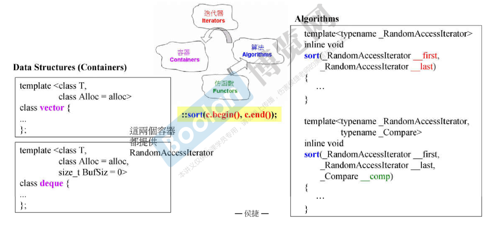

# STL与泛型编程（GP） 侯捷

## 01. 认识[headers]、版本、重要资源

目标：

* level 0: 使用c++标准库
* level 1:认识c++标准库（胸中自有丘壑）
* level 2: 良好使用c++标准库
* level 3:扩充c++标准库


### c++ Standard Library(c++标准库) vs. Standard Template Library(STL, 标准模板库)

标准库以head files形式呈现

### 重要网页

* CPlusPlus.com
* CppReference.com
* gcc.gnu.org


## 02. STL体系结构基础介绍

### STL六大部件（Components）:

* 容器（Containers）
* 分配器（Allocators）
* 算法（Algorithms）
* 迭代器（Iterators）
* 适配器（Adapters）
* 仿函数（Functors）

用到这6个部件的例子:

```c++
#include <vector>
#include <algorithm>
#include <functional>
#include <iostream>

using namespace std;

int main()
{
    int ia[6] = {27, 210, 12, 47, 109, 83};
    vector<int, allocator<int>> vi(ia, ia+6);

    cout << count_if(vi.begin(), vi.end(), 
            not1(bind2nd(less<int>(), 40)));

    return 0;
}
```

## 03. 容器的分类与各种测试（一）

### 容器的分类


### 测试Array

### 测试vector

### 测试list

### 测试forward_list

### 使用容器：deque


### 测试deque

### 测试stack

### 测试queue

----------------------------------


### 测试multiset

### 测试multimap


## 08. 源代码之发布（VC, GCC）

VC和GNU源代码的分布


## 0.9 OOP(面向对象编程) vs. GP(泛型编程)

* OOP企图将datas和methods联系在一起
* GP却是将datas和methods分开来

oop的例程:

```c++
template<class T, calss Alloc=alloc>
class list{
datas1
datas2
...
void sort();
};
```

GP的例程：




**为什么list不能使用::sort排序：**

因为sort算法只能排序可以支持随机访问的指针的容器，list是链表，不支持随机访问某个元素


## 10. 技术基础：操作符重载 and 模板（泛化、全特化、偏特化）

* 操作符重载
* 模板
  * 模板类（类模板）
  * 函数模板
  * 成员模板


**泛化与特化**


**偏特化（partial specialization）**

* 个数的偏特化

  

* 范围的偏特化

  

## 11. 分配器

**operator new()和malloc()的关系**

**各编译器对allocator的使用**

* vc6 STL对allocator的使用
* BC5 STL对allocator的使用
* G2.9 STL对allocator的使用
* G4.9 STL对allocator的使用


