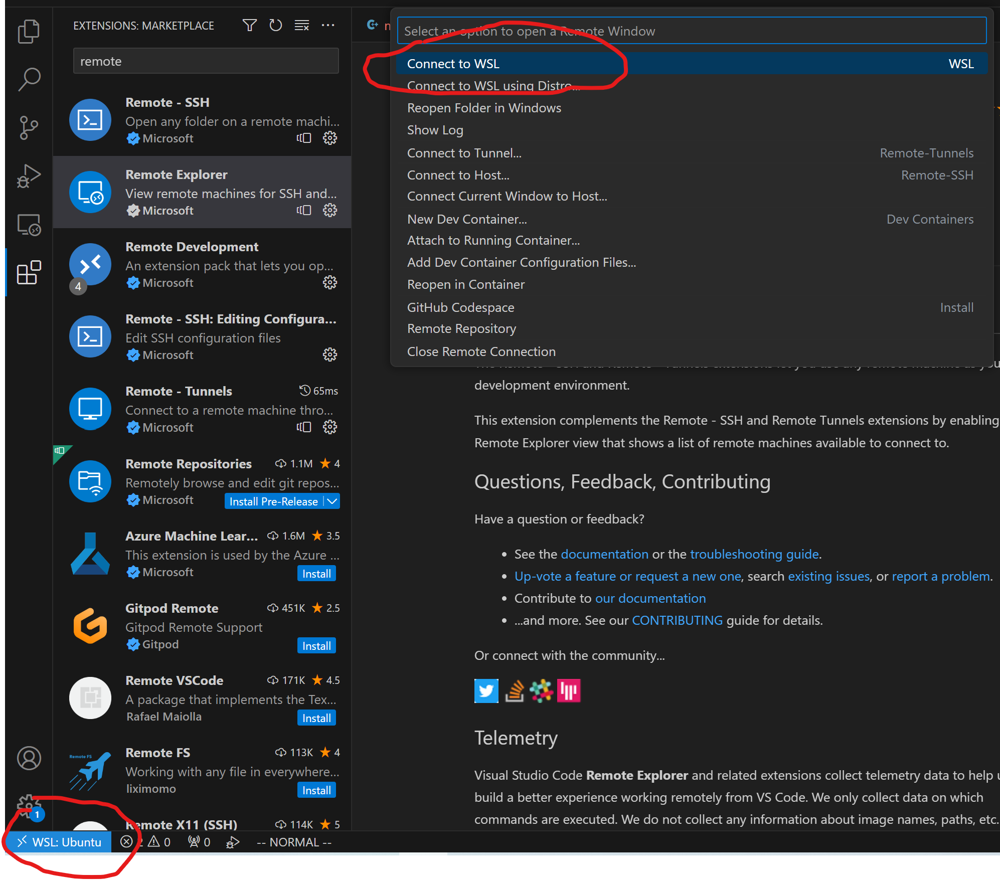

# CMake 保姆级教程

学习资料：

* 视频：`CMake 保姆级教程【c/c++】` 爱编程的大丙  `https://www.bilibili.com/video/BV14s4y1g7Zj`
* 文章：`https://subingwen.cn/cmake/CMake-primer/`

## 1. CMake 概述

## 2. CMake 的使用

### 2.1 注释

注释的两种方式：

* `#` 注释

* `#[[]]` 块注释，如：

  ```cmake
  #[[ 这是一个 CMakeLists.txt 文件。
  这是一个 CMakeLists.txt 文件
  这是一个 CMakeLists.txt 文件]]
  cmake_minimum_required(VERSION 3.0.0)
  ```

### 2.2 第一个示例

添加文件 (详细查看`chapter1`的代码)：

```txt
$ tree
.
├── add.c
├── div.c
├── head.h
├── main.c
├── mult.c
└── sub.c
```

添加`CMakeLists.txt`文件

```cmake
cmake_minimum_required(VERSION 3.0)
project(CALC)
add_executable(app add.c div.c main.c mult.c sub.c)
```

* `cmake_minimum_required` 指定使用的cmake的最低版本

* `project`: 定义工程名称，并可指定工程的版本、工程描述、web主页地址、支持的语言（默认情况支持所有语言），如果不需要这些都是可以忽略的，只需要指定出工程名字即可。

  ```cmake
  # PROJECT 指令的语法是：
  project(<PROJECT-NAME> [<language-name>...])
  project(<PROJECT-NAME>
         [VERSION <major>[.<minor>[.<patch>[.<tweak>]]]]
         [DESCRIPTION <project-description-string>]
         [HOMEPAGE_URL <url-string>]
         [LANGUAGES <language-name>...])
  ```

* `add_executable`：定义工程会生成一个可执行程序

  ```cmake
  add_executable(可执行程序名 源文件名称)
  ```

  * 这里的可执行程序名和project中的项目名没有任何关系
  * 源文件名可以是一个也可以是多个，如有多个可用`空格`或`;`间隔

**执行cmake指令**

* 指令格式：

  ```cmd
  cmake CMakeLists.txt文件所在路径
  ```

* 创建一个build(用来存放编译生成的相关文件)：

  ```cmd
  mkdir build
  cd build;cmake ..
  ```

* 生成的文件大概如下：

  ```txt
  $ tree build -L 1
  build
  ├── CMakeCache.txt
  ├── CMakeFiles
  ├── cmake_install.cmake
  └── Makefile
  
  1 directory, 3 files
  ```

### 2.3 定义变量

`set` 可以用来定义变量。

语法：

```cmake
# SET 指令的语法是：
# [] 中的参数为可选项, 如不需要可以不写
SET(VAR [VALUE] [CACHE TYPE DOCSTRING [FORCE]])

# VAR 变量名
# VALUE 变量值
```

**例子：定义变量用来存储文件名列表**

```cmake
set(SRC_LIST add.c div.c ain.c mult.c sub.c)
```

### 2.4 指定使用的C++标准

在编写C++程序的时候，可能会用到C++11、C++14、C++17、C++20等新特性，那么就需要在编译的时候在编译命令中指定使用哪个标准：

```cmd
$ g++ *.cpp -std=c++11 -o app
```

上面的例子中通过参数`-std=c++11`指定出要使用c++11标准编译程序，C++标准对应有一宏叫做`DCMAKE_CXX_STANDARD`。

在CMake中指定C++标准的两种方式：

* 在 CMakeLists.txt 中通过 set 命令指定

    ```cmake
    #增加-std=c++11
    set(CMAKE_CXX_STANDARD 11)
    #增加-std=c++14
    set(CMAKE_CXX_STANDARD 14)
    #增加-std=c++17
    set(CMAKE_CXX_STANDARD 17)
    ```
	
* 在执行 cmake 命令的时候指定出这个宏的值

    ```cmake
    #增加-std=c++11
    cmake CMakeLists.txt文件路径 -DCMAKE_CXX_STANDARD=11
    #增加-std=c++14
    cmake CMakeLists.txt文件路径 -DCMAKE_CXX_STANDARD=14
    #增加-std=c++17
    cmake CMakeLists.txt文件路径 -DCMAKE_CXX_STANDARD=17
    ```
    

### 2.5 指定输出的路径

在CMake中指定可执行程序输出的路径，对应的宏是`EXECUTABLE_OUTPUT_PATH`：

```cmake
set(HOME /home/robin/sort)
set(EXECUTABLE_OUTPUT_PATH ${HOME}/bin)
```

* 第一行：定义一个变量用于存储一个绝对路径
* 第二行：将拼接好的路径值设置给`EXECUTABLE_OUTPUT_PATH`宏

> 如果此处指定可执行程序生成路径的时候使用的是相对路径 ./xxx/xxx，那么这个路径中的 ./ 对应的就是 makefile 文件所在的那个目录

### 2.6 搜索文件

搜索文件的命令：
* `aux_source_directory`
* `file`

**`aux_source_directory`命令**
该命令可以查找某个路径下的所有源文件（*.c和*.cpp）
命令格式：

```cmake
aux_source_directory(< dir > < variable >)

# dir: 要搜索的目录
# variable: 将从dir目录下搜索到的源文件列表存储到该变量中
```

示例：

```cmake
# 搜索 src 目录下的源文件
aux_source_directory(${CMAKE_CURRENT_SOURCE_DIR}/src SRC_LIST)
```

> `CMAKE_CURRENT_SOURCE_DIR` 宏表示当前访问的 `CMakeLists.txt` 文件所在的路径。

**`file`命令**
格式：

```cmake
file(GLOB/GLOB_RECURSE 变量名 要搜索的文件路径和文件类型)

# GLOB: 将指定目录下搜索到的满足条件的所有文件名生成一个列表，并将其存储到变量中
# GLOB_RECURSE：递归搜索指定目录，将搜索到的满足条件的文件名生成一个列表，并将其存储到变量中
```

示例：

```cmake
file(GLOB MAIN_SRC ${CMAKE_CURRENT_SOURCE_DIR}/src/*.cpp)
file(GLOB MAIN_HEAD ${CMAKE_CURRENT_SOURCE_DIR}/include/*.h)
```

> 要搜索的文件路径和类型可加双引号 :
>
> `file(GLOB MAIN_HEAD "${CMAKE_CURRENT_SOURCE_DIR}/src/*.h")`

### 2.7 包含头文件
`include_directories` 设置要包含头文件
格式：

```cmake
include_directories(headpath)
```

示例：有如下目录结构

```txt
$ tree
.
├── build
├── CMakeLists.txt
├── include
│   └── head.h
└── src
    ├── add.cpp
    ├── div.cpp
    ├── main.cpp
    ├── mult.cpp
    └── sub.cpp

3 directories, 7 files
```

CMakeLists.txt的内容如下：

```cmake
cmake_minimum_required(VERSION 3.0)
project(CALC)
set(CMAKE_CXX_STANDARD 11)
set(HOME /home/robin/Linux/calc)
set(EXECUTABLE_OUTPUT_PATH ${HOME}/bin/)
# 指定头文件的路径
include_directories(${PROJECT_SOURCE_DIR}/include)
file(GLOB SRC_LIST ${CMAKE_CURRENT_SOURCE_DIR}/src/*.cpp)
add_executable(app  ${SRC_LIST})
```

> `PROJECT_SOURCE_DIR` 宏对应的值就是我们在使用cmake命令时，后面紧跟的目录，一般是工程的根目录。

代码参考：`chapter2.7`

### 2.8 制作动态库或静态库

#### 2.8.1 制作静态库

制作静态库的命令：

```cmake
add_library(库名称 STATIC 源文件1 [源文件2])
```

在Linux中，静态库名称分为三部分：`lib` + `库名字` + `.a`，此处只需要指定出库的名字就可以了，另外两部分在生成该文件的时候会自动填充。

windows中虽然库名和linux格式不同，但也只需指定出名字即可。

示例：

将`src`目录中的源文件编译成静态库：

```txt
.
├── build
├── CMakeLists.txt
├── include           # 头文件目录
│   └── head.h
├── main.cpp          # 用于测试的源文件
└── src               # 源文件目录
    ├── add.cpp
    ├── div.cpp
    ├── mult.cpp
    └── sub.cpp
```

 `CMakeLists.txt`文件：

```cmake
cmake_minimum_required(VERSION 3.0)
project(CALC)
include_directories(${PROJECT_SOURCE_DIR}/include)
file(GLOB SRC_LIST ${CMAKE_CURRENT_SOURCE_DIR}/src/*.cpp)
add_library(app STATIC ${SRC_LIST})
```

示例：参考`chapter2.8.1`

#### 2.8.2 制作动态库

制作动态库的命令：

```cmake
add_library(库名称 SHARED 源文件1 [源文件2] ...)
```

动态库的规则类静态库类似，在linux中为：`lib` + `库名字` + `.so`

`CMakeLists.txt`文件：

```cmake
cmake_minimum_required(VERSION 3.0)
project(CALC)
include_directories(${PROJECT_SOURCE_DIR}/include)
file(GLOB SRC_LIST ${CMAKE_CURRENT_SOURCE_DIR}/src/*.cpp)
add_library(app SHARED ${SRC_LIST})
```

示例：参考`chapter2.8.2`


## 补充资料

### 1. win10 的linux 子系统环境安装

> 参考：https://deepinout.com/wsl-tutorials/36_installing_wsl_on_windows_10.html

WSL（Windows Subsystem for Linux）是 Windows 10 系统上的 Linux 子系统。

**1. 启用wsl功能**

1. 打开 PowerShell，以管理员身份运行，输入以下代码并按下回车键：

    ```cmd
    dism.exe /online /enable-feature /featurename:Microsoft-Windows-Subsystem-Linux /all /norestart
    ```

2. 输入以下代码并按下回车键，将 WSL2 设置为默认版本

   ```cmd
   dism.exe /online /enable-feature /featurename:VirtualMachinePlatform /all /norestart
   ```

3. 重启 Windows 10 系统，以便使修改生效。

**2. 从 Microsoft Store 下载 Ubuntu 发行版**

1. 搜索 Microsoft Store，打开它。
2. 在搜索框中输入 Ubuntu，点击搜索按钮。
3. 安装 Ubuntu。如果是第一次下载应用程序，需要输入 Microsoft 账号和密码以进行认证。
4. 安装完成后，Ubuntu 应用程序图标将出现在 Windows 启动菜单中。

**3. 配置和使用**

1. 双击 Ubuntu 应用程序图标打开，在初始化过程中设置用户名和密码。

2. 在 Ubuntu 中可以访问 Windows 系统上的文件和文件夹，即使当前的用户没有管理员权限，也可以使用以下命令跨越多个系统：

   ```cmd
   cd /mnt/d/ # 在 Ubuntu 终端中访问 Windows D 盘
   cd /mnt/e/ # 在 Ubuntu 终端中访问 Windows E 盘
   ```

> 上面安装的貌似是wsl1版本的，wsl2版本的安装还没试过，可以参考 https://deepinout.com/wsl-tutorials/37_installing_wsl2_on_windows_10.html


### 2. vs code 连接wsl

1. 下载插件：`Remote Development`

2. 点击右下角，选择`Connect to WSL`

   