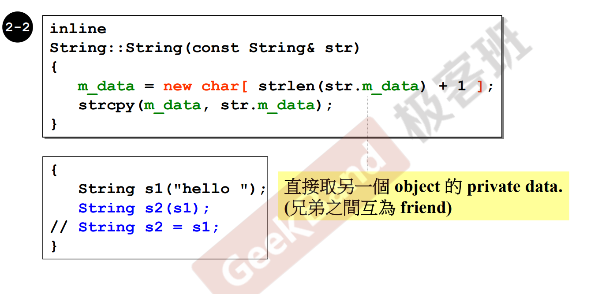

## 观看顺序

- C++面向对象高级开发
- Startup揭秘(工程实践)
- C++内存管理(工程实践)
- STL与泛型编程
- 新标准C++11-14

## C++面向对象高级开发

### 目录

```txt
目录
# 上篇
C++编程简介
头文件与类的生命
构造函数
参数传递和返回值
操作符重载与临时对象
复习Complex类的实现过程
三大函数：拷贝构造，拷贝赋值，析构
堆，栈与内存管理
复习String类的实现过程
扩展补充：类模板、函数模板及其他
复合与继承
虚函数与多态
委托相关设计
# 下篇
导读
conversion function 转换函数
non-explict-one-argument constructor
pointer-like classes 智能指针
function-like classes 仿函数
namespace 经验谈
class template 类模板
Function Template 函数模板
Member Template 成员模板
specialization 模板特化
partial specialization 模板偏特化
模板参数
关于C++标准库
三个主题(和C++有关)
Reference
复合&继承关系下的构造和析构
关于vptr和vtbl
关于Dynamic Binding
关于New,Delete
Operator new，operator delete
示例
重载new(),delete()$示例
Basic_String使用new(extra)扩充申请量
```

### 1. c++编程简介

**目标**

* 培养正规的、大气的编程习惯
* 以良好的方式编写c++ class   `Object Based(基于对象)`
  * `class without pointer members`（不带指针）
    * `Complex`
  * `class with pointer members`（带指针）
    * `String`
* 学习Classes之间的关系  `Object Oriented(面向对象)`
  * 继承（inheritance）
  * 复合（composition）
  * 委托（delegation）

#### 书籍推荐

* `c++ Primer`
* `C++ programming language`
* `effective c++ third edition`
* `effective c++改善程序技术与设计思维的55个有效做法`
* `the C++ standard library`
* `STL源码剖析`

### 2. 头文件与类的声明

#### c++的数据和函数


#### Classes的两个经典分类

* Class without pointer member(s)（不带指针）

  `complex`

* Class with pointer member(s)（带指针）

  `string`


#### c++ 代码的基本形式


#### 输出（c++和c的对比）


#### 头文件中的防卫式声明

使用`#ifndef`、`#define`防止头文件重复加载


#### 头文件的布局


说明：先写1的类声明，再写2类的定义，1和2写完要检查下，有些东西需要先在前面声明。


#### class的声明（declaration）


#### class template(模板)简介


### 3. 构造函数

#### inline（內联）函数

* 函数若定义在类内部，就会被标记成內联函数，最终是否把它设置为內联函数由编译器决定。

* 在类外部定义，可以使用`inline`关键字，来告诉编译器最好把它编译成內联函数


#### 访问级别

```c++
class complex
{
public:
    complex(double r = 0, double i = 0)
    	:re(r), im(i)
    {}
    complex& operator += (const complex &);
    double real() const {return re;};
    double imag() const {return im;};
private:
    double re, im;
    
    friend complex & __doapl (complex*, const complex&);
};
```

不能在外部访问私有成员和函数，如下面的代码是错误的：

```c++
complex c1(2, 1);
count << c1.re;
count << c1.im;
```

#### 构造函数


#### 重载


* c++可以存在同名的函数，但是参数的不能一样
* 上面1和2的构造函数不能同时存在，因为第一个构造函数含有默认值，在构造的时候会和第二个构造函数造成歧义性
* 可以存在两个相同的`real()`函数，一个用来读值，一个用来设置值

#### 构造函数放在private区

可以把构造函数放在private区里面，如下例子

```c++
class A{
public:
    static A& getInstance();
    setup() {}
private:
    A();
    A(const A& rhs);
    ...
};

A& A::getInstance()
{
    static A a;
    return a 
}

// 使用方法
A::getInstance().setup();
```

### 4. 参数传递与返回值

#### 常量成员函数(const member functions)

如果函数不改变数据，可以加一个`const`定义。

举例：

```c++
class complex
{
public:
    complex(double r = 0, double i = 0)
    	:re(r), im(i)
    {}
    complex& operator += (const complex &);
    double real() const {return re;};
    double imag() const {return im;};
private:
    double re, im;
    
    friend complex & __doapl (complex*, const complex&);
};
```

* 当使用如下调用时，`real()`和`image()`函数用不用`const`关键字都没差

  ```c++
  complex c1(2, 1);
  cout << c1.real();
  cout << c1.image();
  ```

* 当使用如下调用时，如果两个函数不加`const`关键字，就会造成歧义。使用者明明定义了c1为`const`类型，而`real()`和`image()`却可以随意修改数据，没有任何限制，这会导致前后矛盾。

  ```c++
  const complex c1(2, 1);
  cout << c1.real();
  cout << c1.image();
  ```

#### 参数传递：传值和传引用（引用可加cons t）


#### 返回值传递：返回值与返回引用


#### 友元（friend）

一个函数被某个类声明为友元函数后，可以直接读取该类的私用函数，如下所示

```c++
class complex
{
public:
    complex(double r = 0, double i = 0)
    	:re(r), im(i)
    {}
    complex& operator += (const complex &);
    double real() const {return re;};
    double imag() const {return im;};
private:
    double re, im;
    
    friend complex & __doapl (complex*, const complex&);
};

//直接读取complex类的私有函数
inline complex& __doapl(complex* ths, const complex &r)
{
    ths->re += r.re;
    ths->im += r.im;
    return *ths;
}
```

#### 相同class的各个objects互为friends(友元)


### 5 操作符重载与临时对象

#### 操作符重载1（成员函数）


说明：

* 成员函数都隐含着一个`this`操作符

#### 语法分析：返回引用（return by refrence）


* 传递者无需知道接收者是以`refrence`形式接收

  例如`c2+=c1`，在调用操作符函数是，`c1`不知道函数是以`const complex&`引用的形式来接收的。

  同理，`__doapl()`虽然返回的是`*ths`，但是返回值是以`complex &`的形式返回回去的，这样更快一点

* 链式赋值：

  `c3 += c2 += c1;`

  操作符函数返回`complex &`类型的作用

#### 操作符重载2（非成员函数）

为了满足client的三种可能用法，这边实现三个对应的函数


#### 临时对象（temp object）


这边不能返回引用的类型，因为返回的是一个局部变量，函数调用完成时生命周期就结束了，所以这边返回的是它的拷贝副本。

#### class body之外的各种定义


#### 操作符重载（非成员函数）


### 6. 复习Complex类的实现过程

略

### 7. 三大函数：拷贝构造、拷贝复制、析构

#### String class

实现一个类，满足下面的做法：

```c++
int main()
{
    String s1();
    String s2("hello");
    
    String s3(s1);
    cout << s3 << endl;
    s3 = s2;
    cout << s3 << endl;
}
```

#### 三个特殊的函数


#### 构造函数和析构函数


#### 类里面有指针成员时，必须自己实现拷贝构造和析构函数

如果没有实现拷贝构造函数和析构函数时，编译器会默认帮你实现。但是类里面如果包含指针时，拷贝构造只是简单的把指针拷贝过去（这种叫做浅拷贝，实际需要把指针指向的值拷贝过去才对），所以我们需要手动实现拷贝构造函数和析构函数，把指针指向的值拷贝过去（深拷贝）。

如下图是手动实现拷贝构造函数和编译器默认生成的拷贝构造函数的对比：


#### 拷贝构造函数和拷贝赋值函数




#### output函数


### 8. 堆、栈与内存管理

#### 栈（stack）和堆（heap）

* **Stack：**是存在于某作用域(scope)中的一块内存空间。例如当你调用函数，函数本身就会形成一个stack来放置它接收的参数，以及返回地址。

  在函数内声明的任何变量，其所使用的内存块都取自上诉的stack

* **Heap：**由操作系统提供的一块global内存空间，程序可动态分配。


#### 生命周期


#### new的过程


#### delete的过程


#### 动态分配内存块（memory block)，在vc的环境下


每格是4个字节

左边两个图：

* 第一个图是在debug模式下new一个`Complex`对象所分配的内存

  * 灰色部分

    用来存储调试模式下所需要的信息

    大小是（32+4）

  * 红色部分

    cookies：用来记录整块内存的大小，这边是64也就是0x40，最后一位用来表示这块内存是给出去还是收回来，所以是0x41

    大小是4*2

  所有部分加起来是56，但是分配的内存必须是16的倍数，所以用64字节的大小

* 第二个图是正常模式底下，new一个`Comeplex`所分配的内存

右边两个图：

​	分别是在debug模式和release模式下，分配String的内存空间

#### 动态分配所得的array


左边两个图（分配`Complex`的空间）

* 第一个图的内存大小是`(8*3)+(32+4)+(4*2)+4`

  最后一个4字节的空间是用来记录数组的大小(这边记录的是整数3)

#### array new一定要搭配array delete


内存泄漏：

不过使用`delete [] p`还是使用`delete p`，上图灰色的部分都会被清空，如果是用`delete p`会造成泄露的是动态分配的部分。即右图中`?!`上的那部分的空间

### 9. 复习String类的实现过程

略

###10. 扩展补充：类模板、函数模板及其他

#### static


